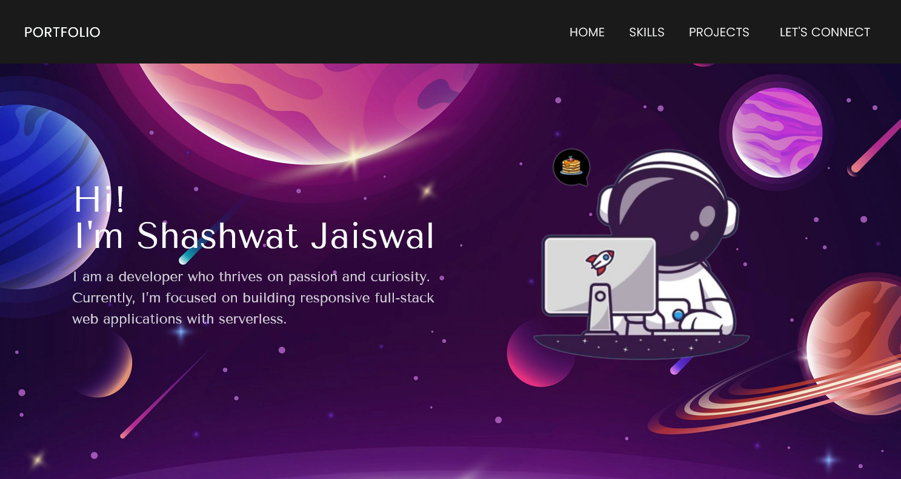

<h1 align="center">Portfolio site</h1>
<p align="center">
    <a href="https://app.netlify.com/sites/okay-head/deploys" target="_blank">
    </a>
     <a href="/LICENSE" target="_blank">
    </a>
    <a href="https://twitter.com/shash0_0" target="_blank">
    
  </a>
</p>

> <p align="center">My first real attempt at making a portfolio site. Designed in Figma.</p>

## [Demo](https://okay-head.netlify.app/)



## Tech stack

- **[React](https://react.dev/)** - for overhead and complexity of virtual dom
- **[Tailwindcss](https://tailwindcss.com/)** - utility first CSS
- **[Framer motion](https://www.framer.com/motion/)** - animation library for react

#### Utilities

- **[React social icons](https://www.npmjs.com/package/react-social-icons)** - no brainer for rendering social icons
- **[Prettier](https://prettier.io/)** - automatic class sorting
- **[Vite](https://vitejs.dev/guide/why.html)** - blazingly fast module bundler
- **[pnpm](https://pnpm.io/)** - performant npm, no dependancy resolution issues

## Install

This project is built with

```
pnpm v8.12.0
node v20.7.0
```

1. If you want to install this repo locally.
   Fork and pull this repo, then run

```sh
pnpm install

or

npm install
```

2. Spin up the development server

```sh
pnpm dev
```

## Continued development

- Revamp of the projects section
- Addition of more sections

## Author

👤 **Shashwat Jaiswal**

- Website: [Link](okay-head.netlify.app)
- Twitter: [@shash0_0](https://twitter.com/shash0_0)
- Github: [@okay-head](https://github.com/okay-head)

## Show your support

Give a ⭐️ if you liked this project!

## License

Copyright © 2024 [Shashwat Jaiswal](https://github.com/okay-head).<br />
This project is [MIT](/LICENSE) licensed.

## Acknowledgements

Quick scaffolding readme by [readme-md-generator](https://github.com/kefranabg/readme-md-generator)
